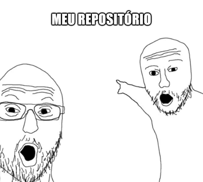

# Olá! me chamo Aline 👋

### 💼 Voluntária no projeto "App - eu visto" atuando no Back-End
### 💻 Tecnologias que eu uso:

  
  
  
  
  

### ✨ Sobre mim
Apaixonada por tecnologia, sempre em busca de novos desafios no desenvolvimento back-end. Faculdade de Análise e Desenvolvimento de Sistemas, onde tenho me dedicado ao aprendizado de tecnologias como Python, FastAPI, e práticas de versionamento com Git.

### 📫 Como me encontrar:

  
  

